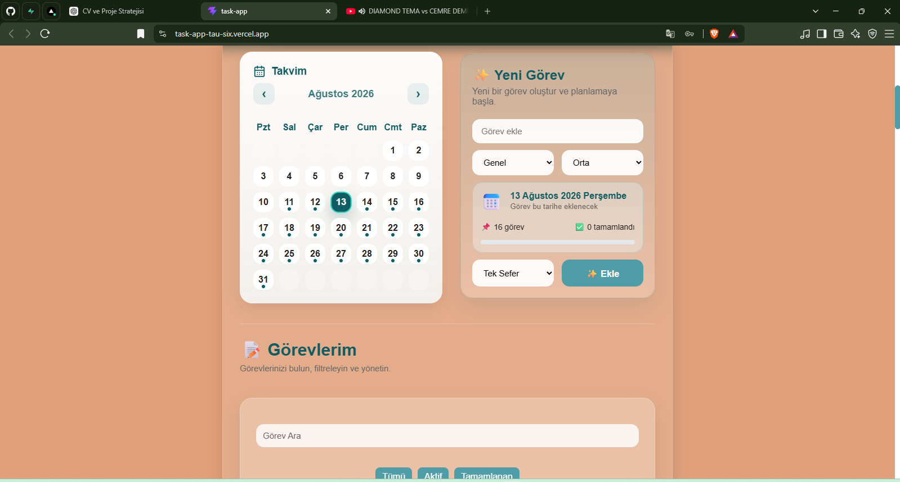
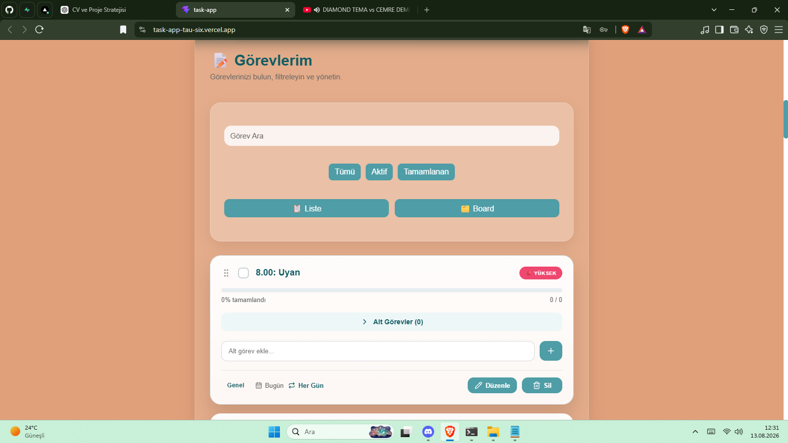
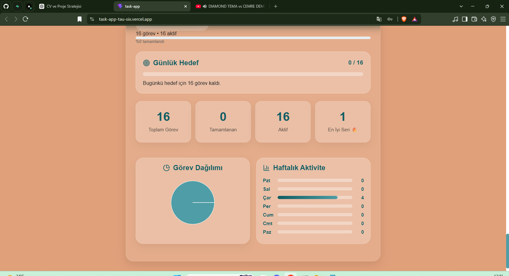
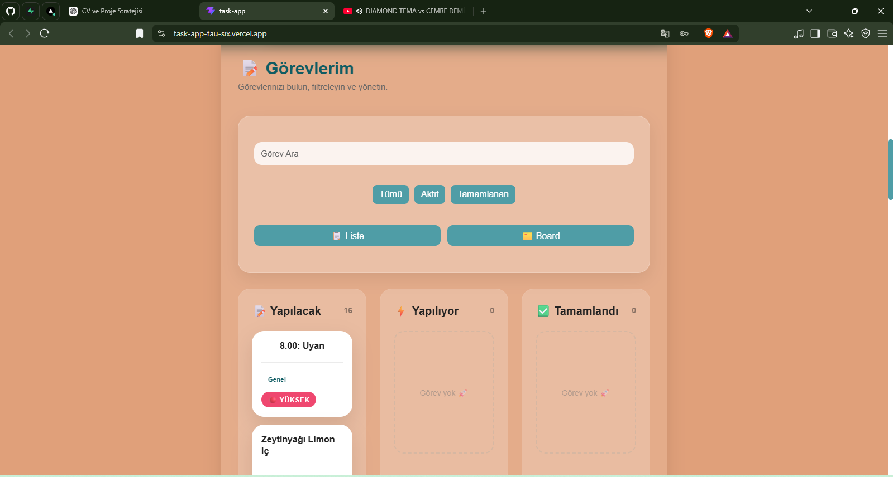

# 🚀 Task App

A modern and responsive task management application built with React and Supabase.

Task App helps users organize their daily tasks, track progress, manage recurring tasks and subtasks, and visualize their productivity through an interactive dashboard.

🌐 **Live Demo:** https://task-app-tau-six.vercel.app/

📦 **GitHub:** https://github.com/Lilith442/task-app

---

## ✨ Features

- 🔐 User authentication with Supabase
- 📝 Create, edit and delete tasks
- ✅ Complete and uncomplete tasks
- 📅 Calendar-based task management
- 🔁 Recurring tasks
  - One time
  - Every day
  - Every 2 days
  - Weekly
- 📌 Subtasks
- 🗂️ List and Board views
- 🖱️ Drag & drop task management
- 🔎 Search tasks
- 🎯 Task filtering
  - All
  - Active
  - Completed
- ⚡ Task priorities
  - Low
  - Medium
  - High
- 📊 Productivity dashboard
- 🔥 Daily streak tracking
- 🏆 Best streak tracking
- 📈 Weekly activity statistics
- 🥧 Task distribution chart
- 🎯 Daily goal tracking
- 🌙 Dark mode
- 🌍 Turkish / English language support
- 📱 Responsive design
- 💾 Persistent application preferences
- ⚡ Real-time task updates with Supabase

---

## 🛠️ Technologies

### Frontend

- React
- JavaScript
- HTML
- CSS
- Vite

### Backend & Database

- Supabase
- PostgreSQL
- Supabase Authentication
- Row Level Security (RLS)
- Realtime

### Libraries

- Framer Motion
- dnd-kit
- Recharts
- Lucide React

### Deployment

- Vercel

---

## 📸 Screenshots

### 📊 Dashboard



The dashboard provides an overview of daily productivity including:

- Daily task progress
- Active and completed tasks
- Daily goals
- Current streak
- Best streak
- Task distribution
- Weekly activity
---

### 📝 Task Management



The task management interface allows users to:

- Create and manage tasks
- Set priorities
- Set due dates
- Create recurring tasks
- Add subtasks
- Search and filter tasks
- Edit and delete tasks

---

### 📈 Analytics



The analytics section displays:

- Daily goal progress
- Completed and active tasks
- Best streak
- Task distribution
- Weekly activity

## 🔁 Recurring Tasks

Tasks can be scheduled to repeat automatically.

Supported recurrence options:

- One Time
- Every Day
- Every 2 Days
- Weekly

Recurring tasks are grouped together so users can manage an individual task, an entire series, or future occurrences.

---

## 🗂️ List & Board Views

Tasks can be viewed in two different layouts.

### List View

A traditional task management interface with:

- Task completion
- Priority
- Category
- Due date
- Recurrence
- Subtasks
- Edit and delete actions

### 🗂️ Board View



Tasks can be organized into:

- Todo
- Doing
- Done

Tasks can be moved between columns using drag & drop.

## 🌍 Internationalization

The application supports two languages:

- 🇹🇷 Turkish
- 🇬🇧 English

The selected language is stored locally so the preference persists between sessions.

---

## 🌙 Dark Mode

Task App includes a dark mode that can be enabled from the interface.

The selected theme is also persisted locally.

---

## 🔐 Authentication & Security

Authentication is handled through Supabase Auth.

Each task is associated with its authenticated user.

Row Level Security (RLS) is enabled to ensure that users can only access their own task data.

Environment variables are used for Supabase configuration and are not included in the repository.

---

## 📱 Responsive Design

The application is designed to work across:

- Desktop
- Tablet
- Mobile

The dashboard, calendar, task cards, board view and controls adapt to smaller screen sizes.

---

## ⚙️ Installation

Clone the repository:

```bash
git clone https://github.com/Lilith442/task-app.git
